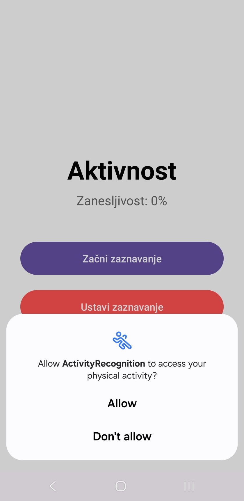
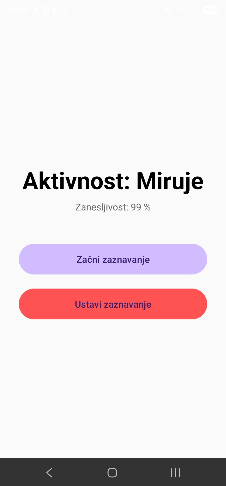
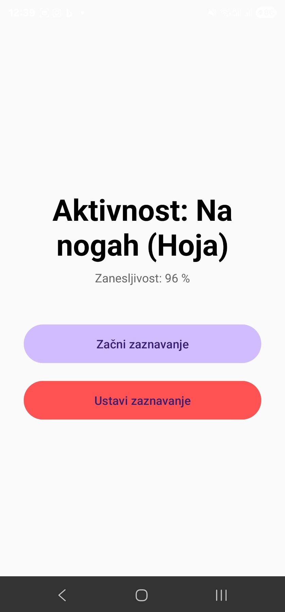
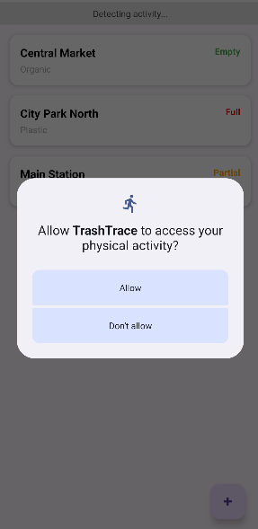
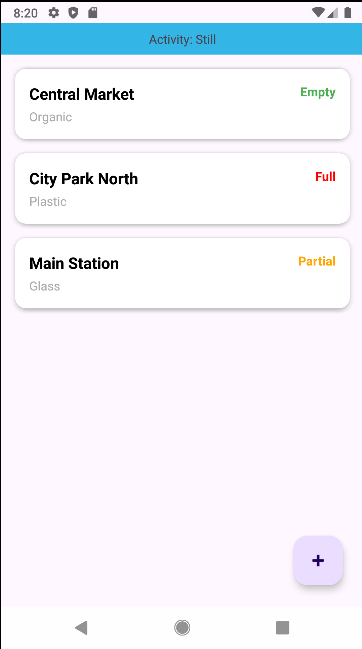

Activity Recognition API🚶‍♂️🚗
===============================

Kratek opis in razlaga izbire
-----------------------------

Ta projekt je demonstracija Android aplikacije, ki uporablja **Google Activity Recognition API** za zaznavanje uporabnikove trenutne fizične aktivnosti (hoja, tek, vožnja, mirovanje itd.) v realnem času.

Za implementacijo sem izbrala knjižnico **Google Play Services Location** (com.google.android.gms:play-services-location), ker ponuja najbolj optimalno rešitev za prepoznavanje aktivnosti na platformi Android. Namesto ročnega branja in obdelave surovih podatkov iz senzorjev (pospeškomer, žiroskop), kar je procesorsko zahtevno in težko za implementacijo, ta API uporablja Googlove modele strojnega učenja. Ti modeli samodejno prepoznajo vzorce gibanja z visoko natančnostjo in minimalno porabo energije.

Prednosti
---------

*   **Energetska učinkovitost:** API samodejno upravlja z uporabo senzorjev in preklopi na način nizke porabe, ko naprava miruje, kar bistveno manj obremenjuje baterijo kot lastna implementacija.
    
*   **Enostavna integracija:** Z uporabo ActivityRecognitionClient in BroadcastReceiver-ja je koda pregledna in enostavna.
    
*   **Natančnost:** Googlovi algoritmi so trenirani na ogromni količini podatkov, kar omogoča zanesljivo razlikovanje med podobnimi aktivnostmi (npr. hoja vs. tek).
    
*   **Podrobna klasifikacija:** Omogoča zaznavanje hierarhičnih aktivnosti (npr. ko zazna "Na nogah", lahko specifično določi tudi "Hojo" ali "Tek").
    

Slabosti
--------

*   **Odvisnost od Google Play storitev:** Aplikacija ne bo delovala na napravah, ki nimajo nameščenih Google Play Services (npr. novejši Huawei telefoni).
    
*   **Zamik pri zaznavanju (Latency):** Sistem ne sporoča sprememb v milisekundah. Da bi se izognili lažnim pozitivnim rezultatom, API pogosto potrebuje nekaj sekund ali minut konsistentnega gibanja, preden s 100-odstotno gotovostjo potrdi spremembo aktivnosti.
    
*   **Potrebna dovoljenja:** Uporabnik mora eksplicitno dovoliti dostop do senzorjev za telesno dejavnost (ACTIVITY\_RECOGNITION), kar lahko nekateri uporabniki zavrnejo zaradi zasebnosti.
    

Licenca
-------

Projekt je na voljo pod licenco **Apache 2.0**. To dovoljuje prosto uporabo, spreminjanje in distribucijo kode, vključno s komercialno rabo, pod pogojem, da se ohrani obvestilo o avtorskih pravicah in licenci.

Število uporabnikov
-------------------

Potencialno število uporabnikov tehnologije je izjemno veliko, saj je ActivityRecognitionClient del standardnega Android ekosistema. Tehnologijo uporablja večina modernih fitnes aplikacij (Strava, Google Fit, Samsung Health) in navigacijskih sistemov (Google Maps), kar pomeni, da je preizkušena na **milijardah naprav** po vsem svetu.

Časovna in prostorska zahtevnost
--------------------------------

*   **Časovna zahtevnost:** Procesiranje v aplikaciji je minimalno (**O(1)**). Ob vsakem prejetem "dogodku" (Broadcast), aplikacija le prebere seznam verjetnosti in posodobi uporabniški vmesnik. Težko delo obdelave signalov se izvaja v ozadju znotraj sistemskega procesa Google Services.
    
*   **Prostorska zahtevnost:** Aplikacija je zelo lahka. Ker ne shranjujemo zgodovine podatkov v bazo, je poraba pomnilnika zanemarljiva. Sama knjižnica Google Play Services je del operacijskega sistema, zato ne povečuje bistveno velikosti namestitvene datoteke (APK).
    

Vzdrževanje tehnologije
-----------------------

Tehnologijo vzdržuje **Google** kot del paketa Google Play Services. To zagotavlja:

*   Redne varnostne posodobitve in izboljšave algoritmov brez potrebe po posodabljanju naše aplikacije (posodobi se servis v ozadju).
    
*   Dolgoročno podporo in kompatibilnost za nazaj (backward compatibility).
    
*   Na strani razvijalca je potrebno le občasno posodabljanje različice knjižnice v build.gradle.kts (trenutno uporabljena verzija: 21.0.1).


Ključni deli implementacije 💻
-------------------

Za delovanje API-ja so ključni naslednji trije koraki: dovoljenja, inicializacija odjemalca in prejemanje rezultatov.

**1. Dovoljenja (AndroidManifest.xml)**
Brez tega dovoljenja aplikacija ne more dostopati do senzorjev. Od Android 10 (API 29) dalje je potrebno to dovoljenje zahtevati tudi v času izvajanja (Runtime permission).

```xml
<manifest ...>
    <uses-permission android:name="android.permission.ACTIVITY_RECOGNITION" />
    <uses-permission android:name="com.google.android.gms.permission.ACTIVITY_RECOGNITION" />
    ...
</manifest>
```

**2. Zahteva za posodobitve (ActivityRecognitionManager.kt)**
Tu ustvarimo `PendingIntent` in naročimo sistem, da nam pošilja podatke vsake 3 sekunde (oz. ko sistem zazna spremembo).

```kotlin
// Inicializacija Google Client-a
private val client = ActivityRecognition.getClient(context)

fun startTracking(onSuccess: () -> Unit, onFailure: (Exception) -> Unit) {
    client.requestActivityUpdates(
        3000L, // Interval zaznavanja (v milisekundah)
        pendingIntent // Kam naj sistem pošlje rezultat (BroadcastReceiver)
    ).addOnSuccessListener { onSuccess() }
     .addOnFailureListener { onFailure(it) }
}
```

**3. Obdelava rezultatov (ActivityReceiver.kt)**
Ko sistem zazna aktivnost, sproži ta `BroadcastReceiver`, kjer izluščimo najbolj verjetno aktivnost in njeno zanesljivost (confidence).

```kotlin
override fun onReceive(context: Context, intent: Intent) {
    if (ActivityRecognitionResult.hasResult(intent)) {
        val result = ActivityRecognitionResult.extractResult(intent)!!
        
        // Dobimo najbolj verjetno aktivnost
        val activity = result.mostProbableActivity
        
        // Primer: "Detected: Walking - 85%"
        Log.d("Detected: ${getActivityString(activity.type)} - ${activity.confidence}%")
    }
}
```

**4. Analiza podatkov v ozadju (Logcat)**
Da bi preverili natančnost delovanja, lahko spremljemo izpis v konzoli. Spodnja slika prikazuje, kako API ne vrne le ene same aktivnosti, temveč seznam verjetnosti za različne aktivnosti hkrati.

<p align="center">
  
</p>

Izgled aplikacije (Demo)
-------------------

Spodaj je prikazan prikaz delovanja aplikacije na fizični napravi, kjer sistem prepozna aktivnost počitka in hoje.
Vidimo lahko tudi, da zahteva dovoljenje.

<p align="center">
  
  
  
</p>


Izgled aplikacije (TrashTrace)
-------------------

<p align="center">
  
  
</p>